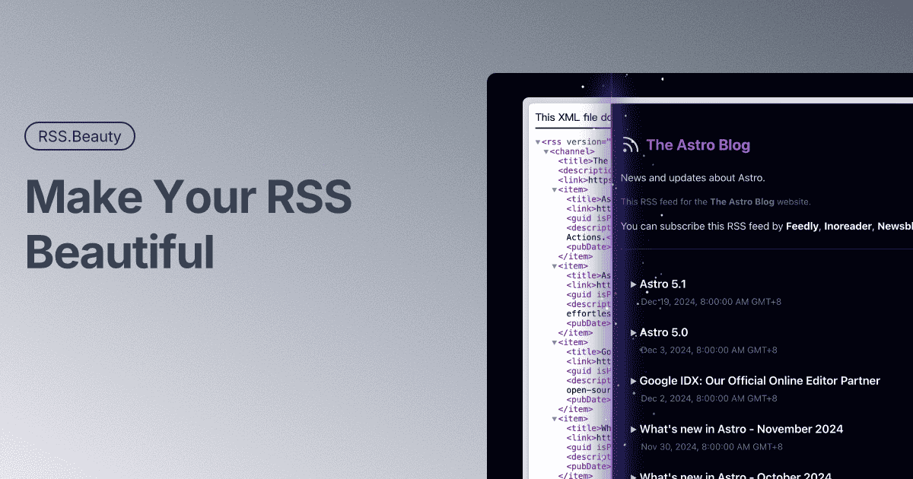

# RSS.Beauty

让 RSS 变漂亮! | Make Your RSS Beautiful!

---

[English](./README.md) | 简体中文

[RSS.Beauty](https://rss.beauty/) 是一个基于 XSLT 技术的 RSS 美化工具, 可以将普通的 RSS/Atom 订阅源转换成美观的阅读界面。



## 主要特性

- 🎨 精美的阅读界面
- 🔄 支持 RSS 2.0 和 Atom 1.0
- 📱 响应式设计, 支持移动端
- 🔌 一键订阅到主流 RSS 阅读器
- 🖥 支持部署到自己服务器

## 快速开始

访问 [RSS.Beauty](https://rss.beauty) 并输入任意 RSS 订阅源链接即可体验。

## 技术栈

- [Astro](https://astro.build)
- [TailwindCSS](https://tailwindcss.com)
- [XSLT](https://www.w3.org/TR/xslt/)

## 部署

### Serverless

支持部署到 Cloudflare Pages, Vercel, Netlify 等平台，[Fork](https://github.com/ccbikai/RSS.Beauty/fork) 此项目后按平台教程操作即可。

### Docker

```bash
docker pull ghcr.io/ccbikai/rss.beauty:main
docker run -d --name rss-beauty -p 4321:4321 ghcr.io/ccbikai/rss.beauty:main
```

## 致谢

- [Tailus UI](https://html.tailus.io/)

## 赞助

1. [在 𝕏 上关注我](https://404.li/x)
1. [在 GitHub 赞助我](https://github.com/sponsors/ccbikai)
